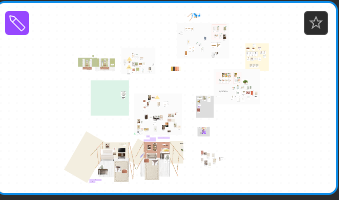
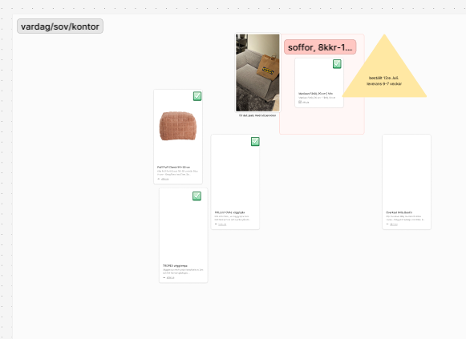

# React + TypeScript + Vite

This template provides a minimal setup to get React working in Vite with HMR and some ESLint rules.

Currently, two official plugins are available:

- [@vitejs/plugin-react](https://github.com/vitejs/vite-plugin-react/blob/main/packages/plugin-react/README.md) uses [Babel](https://babeljs.io/) for Fast Refresh
- [@vitejs/plugin-react-swc](https://github.com/vitejs/vite-plugin-react-swc) uses [SWC](https://swc.rs/) for Fast Refresh

## Expanding the ESLint configuration

If you are developing a production application, we recommend updating the configuration to enable type aware lint rules:

- Configure the top-level `parserOptions` property like this:

```js
export default tseslint.config({
  languageOptions: {
    // other options...
    parserOptions: {
      project: ["./tsconfig.node.json", "./tsconfig.app.json"],
      tsconfigRootDir: import.meta.dirname,
    },
  },
});
```

- Replace `tseslint.configs.recommended` to `tseslint.configs.recommendedTypeChecked` or `tseslint.configs.strictTypeChecked`
- Optionally add `...tseslint.configs.stylisticTypeChecked`
- Install [eslint-plugin-react](https://github.com/jsx-eslint/eslint-plugin-react) and update the config:

```js
// eslint.config.js
import react from "eslint-plugin-react";

export default tseslint.config({
  // Set the react version
  settings: { react: { version: "18.3" } },
  plugins: {
    // Add the react plugin
    react,
  },
  rules: {
    // other rules...
    // Enable its recommended rules
    ...react.configs.recommended.rules,
    ...react.configs["jsx-runtime"].rules,
  },
});
```

## What is this?

Hej välkommen till mitt projekt. Lite bakgrund kan vara nice to have!

I somras flyttade jag ganska snabbt. Det va inte superkul men en erfarenhet helt enkelt. I och med denna flytt så behövde jag också möbler, typ alla möbler. Så med mycket fritid på mina händer började jag plannera i detalj hur mitt nya hem skulle se ut. Färger, möbler, lister, you name it. Detta gjorde jag i figma i ett sorterat kaos. Två bilder på hur det såg ut, utzoomat och _enhanced_.




Det är härifrån som jag fått min första projektidee som jag faktiskt är taggad att genomföra. Jag vill kunna organisera min plannering av inköp till hemmet, eller i alla fall utgå från den strukturen. Så jag vill ha saker, placerade i rum, med länkar-kostnader-bilder-namn etc så att man 1. får en överblick på vad man vill köpa, och 2. sen vill jag kunna få ut alla kostnader i ett excellark.

## Resources

[icons](https://heroicons.com/solid)
[inspo palette](https://coolors.co/palette/ccd5ae-e9edc9-fefae0-faedcd-d4a373)
[generate theme with realtime colors](https://www.realtimecolors.com/?colors=612800-ffe0d1-9fc46e-c3de8c-da9d72&fonts=Inter-Inter)
[atomic design](https://atomicdesign.bradfrost.com/table-of-contents/)

## TODOs

- ~~screen-state in theme (web, phone or tablet)~~
- mobile-first navbar (hamburger menu)
- ~~lazy image loader component~~
- ~~typography component~~
- ~~component for furniture~~
- ~~component for rooms~~
- ~~form for new furniture~~
- ~~use formik for forms, try something new!~~
- mock room data in redux, change with queries to mock api calls (?)
- get tests to run in precommit script
- change background of rooms (like change wall-color, change the cards background)
- ~~change color theme, don't know what i was thinking~~
- use perfectionist.dev for alphabetical sorting of everything
- icons from react-icons ? on npm
- tanstack-virtual for virtualization of lists
- ~~create fullscreen-modal component~~
- ~~create form for creating new furniture~~
- gather all todos and fix them

## Kinda big todos so mock this

- learn about database structure
- users, rooms etc set up how data is stored
- authentication for users
- routes for users and their rooms
